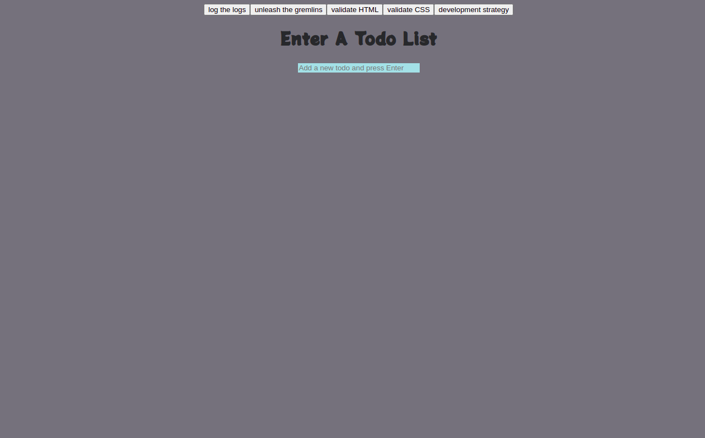

# List manger


> A simple website allows the user to create and delete todo lists and add or remove items to each list.

## Table of contents
* [General info](#general-info)
* [Screenshots](#screenshots)
* [Technologies](#technologies)
* [Setup](#setup)
* [Features](#features)
* [Status](#status)
* [Inspiration](#inspiration)
* [Contact](#contact)

## General info

A simple JavaScript website allows the user to create many `TODO lists`, the objective is using `prototypes` to create many objects using `object.create` method.

## Screenshots


## Technologies
* JavaScript
* HTML
* CSS
* VSC code


## Setup
open the website and create as many `todo list as you want`

## Code Examples

```js
'use strict';

"use strict";

import { listPrototype } from "../list-prototype.js";
import { logger } from "../../lib/logger.js";

export const createNewListHandler = (event) => {

  // Number 13 is the "Enter" key on the keyboard
  if (event.keyCode !== 13) {
    return;
  }
  if (event.target.value === "") {
    alert("Please Enter A Todo list!");
    return;
  }
   document.body.style = "backdrop-filter: blur(2px) ;";
  const newList = Object.create(listPrototype);
  newList.state = {
    header: event.target.value,
    todos: [],
  };

  const renderedNewList = newList.render();

  document.getElementById("lists").appendChild(renderedNewList);

  logger.push({
    action: "create new list",
    event,
    newList,
    renderedNewList,
  });
  event.target.value = "";
};
```


## Features
List of features ready and TODOs for future development

* 
* 
* 

To-do list:

* 
* 

## Status
Project is: _in progress_

## Inspiration

from `Watch and Code`

## Contact
By [@samirm00] 